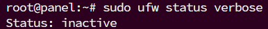
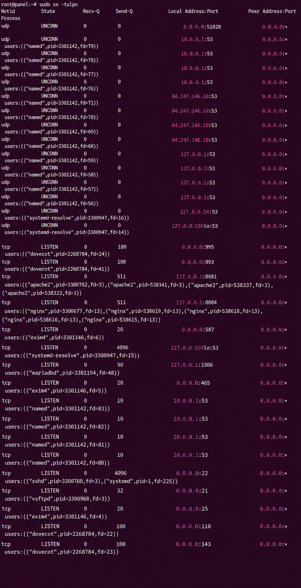
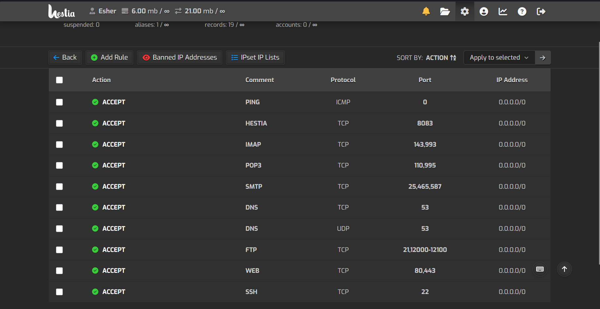
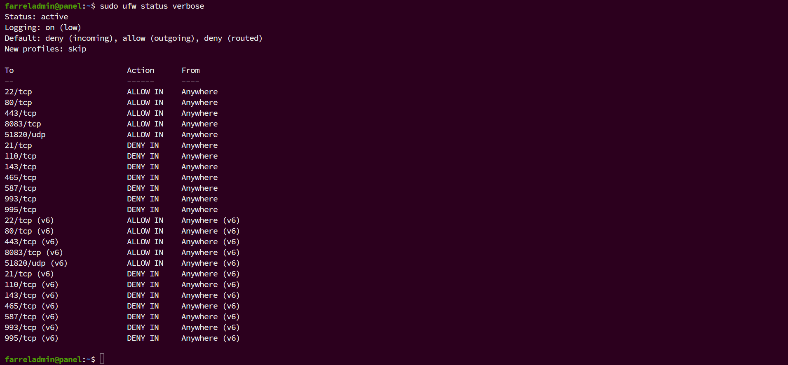
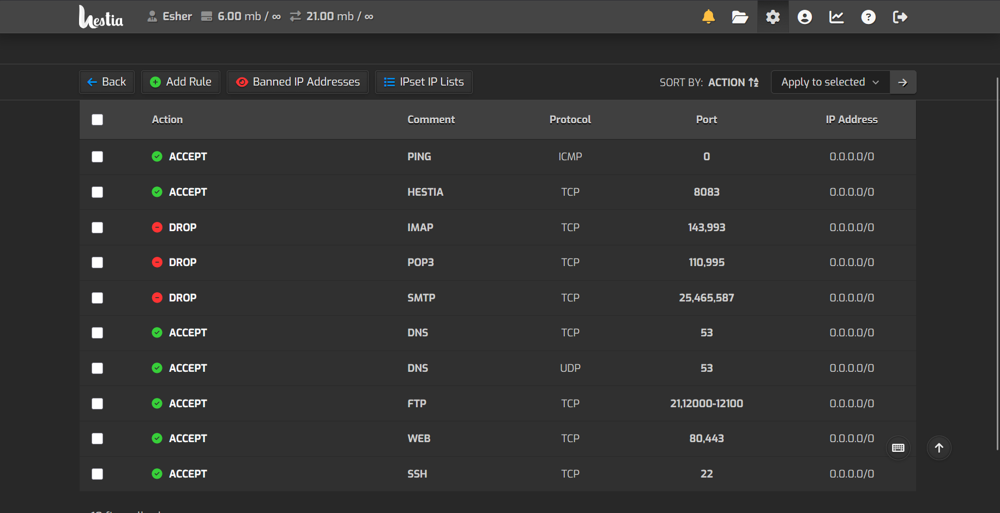
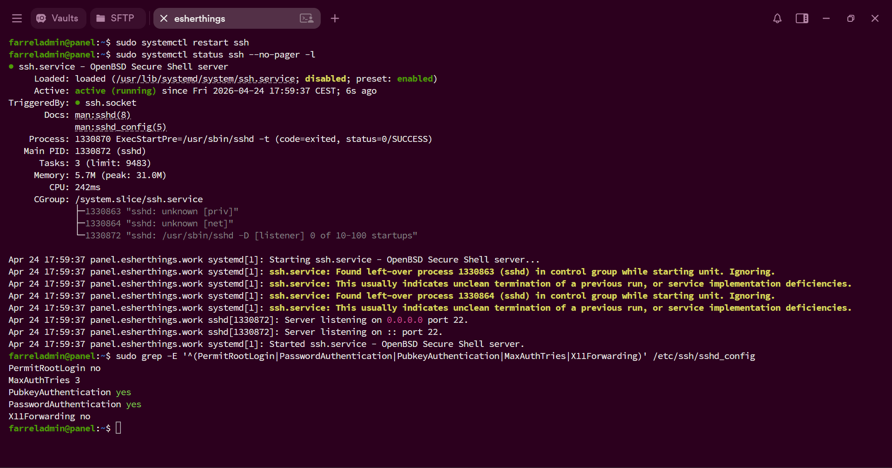
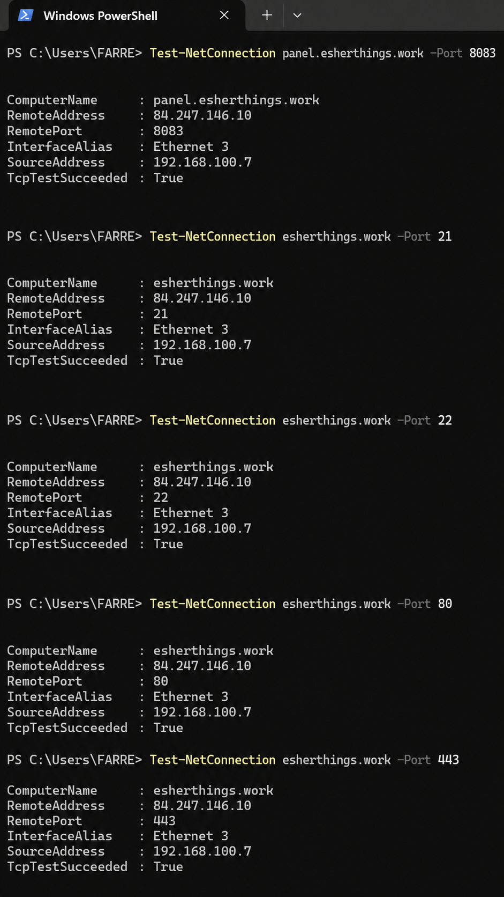
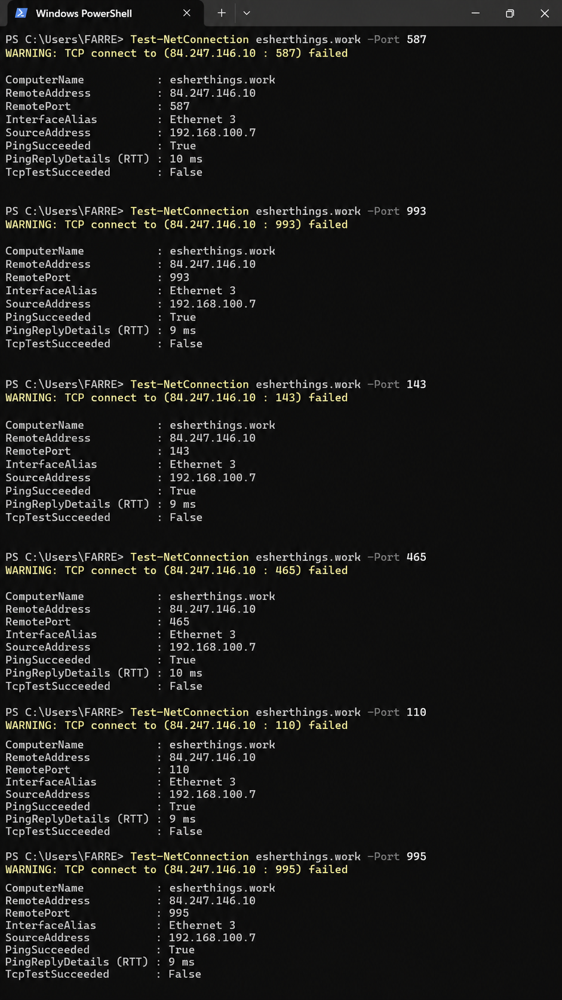

# Ubuntu VPS Security Hardening

## Overview

This project documents the security hardening of a public-facing Ubuntu VPS used to host my personal portfolio website. The goal was to reduce unnecessary public exposure, improve firewall control, harden SSH access, and validate that required services remained available after the changes.

The project was performed on a live VPS environment, making it more realistic than a fully isolated lab. All changes were applied carefully to avoid breaking access to the website, Hestia control panel, SSH, and FTP workflow.

## Project Objectives

- Assess the initial security posture of a public Ubuntu VPS
- Identify exposed services and unnecessary open ports
- Enable and validate firewall controls
- Tighten Hestia firewall rules for unused mail services
- Harden SSH configuration
- Validate changes using external connectivity tests
- Document the process as a practical server hardening case study

## Environment

| Component | Details |
|---|---|
| Server Type | VPS |
| Operating System | Ubuntu 24.04 LTS |
| Hosting Provider | Contabo |
| Control Panel | Hestia Control Panel |
| Web Stack | Nginx, Apache, PHP-FPM |
| Database | MariaDB |
| Security Tools | UFW, Fail2Ban, Hestia Firewall |
| Main Use Case | Hosting a personal portfolio website |

## Initial Findings

During the baseline assessment, the server had multiple public-facing services enabled. The host firewall was inactive, and several ports related to mail, FTP, DNS, web services, SSH, and the control panel were listening.

Key observations:

- UFW firewall was inactive
- Multiple TCP services were publicly exposed
- Mail-related services were reachable from the internet
- Hestia firewall allowed IMAP, POP3, SMTP, FTP, DNS, web, SSH, and panel access
- SSH root login was enabled
- X11 forwarding was enabled
- Real SSH login attempts from external IP addresses appeared in authentication logs

## Screenshots

### 1. UFW inactive before hardening

The initial check showed that UFW was inactive.



### 2. Open ports before hardening

The baseline port review showed several public TCP services listening on the server.



### 3. Hestia firewall before changes

Before hardening, Hestia allowed mail-related services such as IMAP, POP3, and SMTP.



## Hardening Actions

### 1. Enabled UFW firewall

UFW was enabled with a default-deny inbound policy, while Hestia firewall rules were also reviewed because the server stack uses Hestia to manage public service access. Required services were allowed to avoid breaking access.

Allowed services:

| Service | Port |
|---|---|
| SSH | 22/tcp |
| HTTP | 80/tcp |
| HTTPS | 443/tcp |
| Hestia Panel | 8083/tcp |
| WireGuard | 51820/udp |



### 2. Updated Hestia firewall rules

The Hestia firewall was updated to block unused mail-related services while keeping required services available.

Changed to DROP:

| Service | Port |
|---|---|
| POP3 | 110, 995 |
| IMAP | 143, 993 |
| SMTP | 25, 465, 587 |

Kept as ACCEPT:

| Service | Port |
|---|---|
| SSH | 22 |
| Web | 80, 443 |
| Hestia Panel | 8083 |
| FTP | 21, 12000-12100 |
| DNS | 53 |

FTP was kept open because it was still needed for website editing.



### 3. Hardened SSH configuration

SSH was hardened by disabling direct root login, disabling X11 forwarding, and reducing the maximum authentication attempts.

Final SSH settings:

```text
PermitRootLogin no
MaxAuthTries 3
PubkeyAuthentication yes
PasswordAuthentication yes
X11Forwarding no
```

Password authentication was kept enabled temporarily to avoid losing access while SSH key-based authentication is prepared.



## Validation

### Required ports remained reachable

External validation was performed from a separate Windows machine using PowerShell `Test-NetConnection`.

The following required ports remained reachable after hardening:

| Service | Port | Result |
|---|---:|---|
| SSH | 22 | Reachable |
| HTTP | 80 | Reachable |
| HTTPS | 443 | Reachable |
| Hestia Panel | 8083 | Reachable |
| FTP | 21 | Reachable |



### Unused mail ports were blocked

After applying the firewall changes, unused mail-related ports were no longer reachable externally.

| Service | Port | Result |
|---|---:|---|
| POP3 | 110 | Blocked |
| IMAP | 143 | Blocked |
| SMTPS | 465 | Blocked |
| Mail Submission | 587 | Blocked |
| IMAPS | 993 | Blocked |
| POP3S | 995 | Blocked |



## Before and After Summary

| Area | Before | After |
|---|---|---|
| UFW | Inactive | Active |
| Public mail ports | Reachable | Blocked |
| SSH root login | Enabled | Disabled |
| X11 forwarding | Enabled | Disabled |
| Max authentication attempts | Default | Limited to 3 |
| Website availability | Working | Still working |
| Hestia panel | Reachable | Still reachable |
| FTP workflow | Reachable | Still reachable |

## Security Improvements

This project improved the server security posture by:

- Reducing unnecessary public exposure
- Enforcing firewall rules through UFW and Hestia
- Blocking unused mail-related services
- Preserving required services for website management
- Disabling direct root SSH login
- Disabling unnecessary X11 forwarding
- Reducing SSH brute-force attack surface
- Confirming that authentication attempts were visible in logs

## Tools and Commands Used

### System and service review

```bash
hostnamectl
ss -tulpn
sudo ufw status verbose
sudo systemctl list-units --type=service --state=running
df -h
free -h
```

### Firewall configuration

```bash
sudo ufw allow 22/tcp
sudo ufw allow 80/tcp
sudo ufw allow 443/tcp
sudo ufw allow 8083/tcp
sudo ufw allow 51820/udp
sudo ufw enable
sudo ufw status verbose
```

### Hestia firewall changes

The following service rules were changed from ACCEPT to DROP inside the Hestia firewall interface:

```text
IMAP: 143, 993
POP3: 110, 995
SMTP: 25, 465, 587
```

### SSH hardening

```bash
sudo cp /etc/ssh/sshd_config /etc/ssh/sshd_config.bak
sudo nano /etc/ssh/sshd_config
sudo sshd -t
sudo systemctl restart ssh
sudo systemctl status ssh --no-pager -l
```

### External validation from Windows

```powershell
Test-NetConnection esherthings.work -Port 22
Test-NetConnection esherthings.work -Port 80
Test-NetConnection esherthings.work -Port 443
Test-NetConnection panel.esherthings.work -Port 8083
Test-NetConnection esherthings.work -Port 21
Test-NetConnection esherthings.work -Port 110
Test-NetConnection esherthings.work -Port 143
Test-NetConnection esherthings.work -Port 465
Test-NetConnection esherthings.work -Port 587
Test-NetConnection esherthings.work -Port 993
Test-NetConnection esherthings.work -Port 995
```

## Skills Demonstrated

- Linux server administration
- VPS security hardening
- Firewall configuration
- Hestia control panel firewall management
- SSH security configuration
- Service exposure review
- External port validation
- Defensive security documentation

## Limitations

This project focused on server hardening and exposure reduction. FTP was intentionally kept open because it was still required for website editing. Although UFW contained deny rules for FTP from earlier testing, Hestia firewall rules continued to allow FTP access for the current workflow. This is documented as a limitation, with a planned future migration from FTP to SFTP or Git-based deployment.

Password authentication was also kept enabled temporarily to avoid access issues while SSH key-based login is prepared.

DNS was kept open because the server is managed through Hestia and may be used for domain-related services.

## Future Improvements

- Replace FTP workflow with SFTP or Git-based deployment
- Disable password-based SSH login after confirming SSH key access
- Restrict SSH access by IP address or VPN
- Add centralized logging with Wazuh
- Add file integrity monitoring
- Create alert rules for SSH brute-force attempts
- Review DNS exposure if external DNS hosting is no longer required
- Automate recurring security checks

## Conclusion

This project demonstrates a practical hardening process for a live Ubuntu VPS hosting a portfolio website. The server was moved from a broad-exposure baseline to a more controlled configuration while keeping required services operational.

The final result reduced unnecessary public access, improved SSH security, and created a clear foundation for future monitoring with Wazuh or another SIEM platform.
